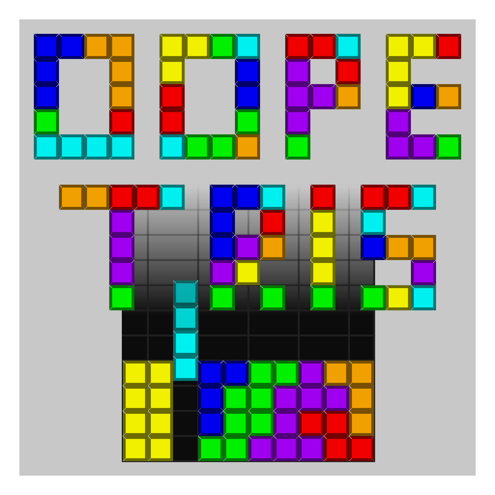

# OOPetris

## What is this?

This is a cross-platform [Tetris](https://en.wikipedia.org/wiki/Tetris) implementation in C++.
It is written in [OOP](https://en.wikipedia.org/wiki/Object-oriented_programming)-style using [SDL2](https://www.libsdl.org/).

## Platform support

This officially supports Linux, Windows, MacOS, Android, Serenity OS, Nintendo Switch and Nintendo 3DS.

Why these? Because it was fun to port the application to those platforms 😋

## Usage

You can self-build the application easily.

For concrete instructions see [here](docs/develop.md)

Or you can download and use prebuilt binaries from the CI-builds. You can find supported platforms here:

To download artifacts, click on the newest action and download the artifacts.

[Android](https://github.com/mgerhold/oopetris/actions/workflows/android.yml)

[Linux (Flatpak)](https://github.com/mgerhold/oopetris/actions/workflows/flatpak.yml)

[Nintendo Switch /3DS](https://github.com/mgerhold/oopetris/actions/workflows/nintendo.yml)

There is no correct Windows and MacOS build atm, you have to built it yourself or use the (maybe not published yet) release builds on github.

## Logo

